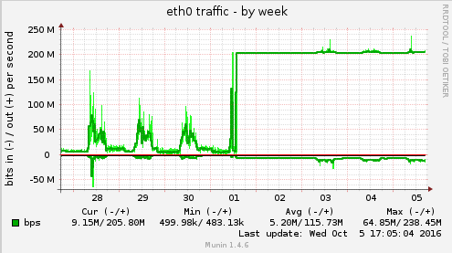

# Google open image download

A py2/py3 script for downloading and rescaling the [open image
dataset](https://github.com/openimages/dataset) in parallel. Here it is maxing out a 200mbit pipe.



## setup

To install dependencies run

```
pip install -r requirements
```

Follow the instructions on the [open image data repo](https://github.com/openimages/dataset) to
get the list of image urls.

## usage

The two requirement arguments are `input` and `output`. Input is the csv file of urls from the open
image data set. Output is a directory where the scaled images will be saved. 

By default, the images will be scaled so that the smallest dimension is equal to 256 (controlled by 
the `min-dim` arg). The saved images are placed in sub-directories for efficiency (the number of 
which is controlled by the `sub-dirs` arg). The name of the saved image corresponds to Google's 
`ImageID` which can be used to look up labels in the open image dataset. 

Use `--help` to see the other optional args.

## notes

I'm not using asyncio because the processes also scale the image so we wouldn't see much speed up

